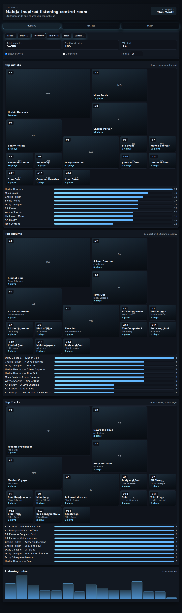
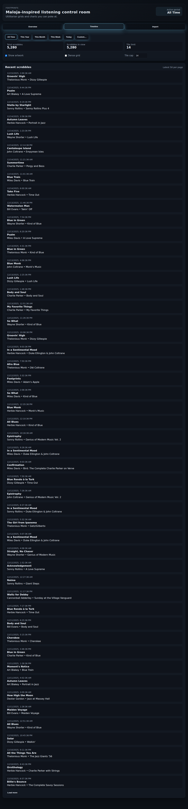

# 🎵 Footprints

Self-hosted music history manager with stats, reports and charts, inspired by [maloja](https://github.com/krateng/maloja).

## Features

- 📊 **Statistics & Analytics**: Track your listening habits with detailed stats
- 📈 **Charts & Reports**: View yearly, monthly, and all-time reports
- 📅 **Timeline**: Browse your complete listening history
- 🔄 **Multi-source Import**: Import from Last.fm and ListenBrainz
- 🚫 **Deduplication**: Automatic prevention of duplicate scrobbles
- 🐳 **Docker Support**: Easy deployment with Docker and docker-compose
- ⚡ **Lightweight**: Minimal dependencies, fast and efficient
- 🗄️ **SQLite Database**: Simple, portable database storage

## Screenshots

### Overview Dashboard
Track your top artists, albums, and tracks with detailed statistics and beautiful visualizations.


### Monthly Statistics
Filter your listening data by time periods to see your music habits over time.



### Timeline
Browse your complete listening history with detailed scrobble information.



*Screenshots show demo data with jazz artists and standards including Miles Davis, John Coltrane, Herbie Hancock, and classic albums like "Kind of Blue" and "A Love Supreme".*

## Tech Stack

- **Backend**: Rust with Axum web framework
- **Database**: SQLite with rusqlite
- **Frontend**: Vanilla HTML/CSS/JavaScript (no frameworks)
- **Deployment**: Docker & docker-compose

## Quick Start

### Using Nix Flakes (Recommended for NixOS)

```bash
# Development environment
nix develop

# Run directly
nix run

# Build the package
nix build
```

### Using Docker Compose

1. Create a `.env` file in the project root with your Last.fm API key:

```env
LASTFM_API_KEY=your_lastfm_api_key_here
```

2. Start the application:

```bash
docker-compose up -d
```

The application will be available at `http://localhost:3000`

**Note**: To enable artist/album images in the UI, you need a Last.fm API key. Get one for free at https://www.last.fm/api/account/create

### Manual Build

```bash
# Build the application
cargo build --release

# Run the application
cargo run --release
```

## Configuration

Create a `.env` file in the project root:

```env
# Database configuration
DATABASE_PATH=footprints.db

# Server configuration
PORT=3000

# Logging level
RUST_LOG=footprints=info

# Last.fm API key for artist/album images (required for Maloja-style UI)
# Get your API key at: https://www.last.fm/api/account/create
LASTFM_API_KEY=your_lastfm_api_key_here
```

**Important**: The `LASTFM_API_KEY` is required for the new Maloja-style UI to display artist and album images. Without it, the application will still work but will show gradient placeholders instead of images.

## Usage

1. **Access the Web Interface**: Open `http://localhost:3000` in your browser

2. **Import Data** (One-time):
   - Go to the "Import" tab
   - For Last.fm: Enter your username and API key (get one at https://www.last.fm/api/account/create)
   - For ListenBrainz: Enter your username (token is optional)
   - Click import and wait for the process to complete

3. **Automatic Sync** (Optional):
   - Set up automatic sync via the API (see Sync API section below)
   - Configure sync interval (default: 60 minutes)
   - Sync runs in the background and fetches only new scrobbles
   - No duplicates will be created thanks to database constraints

4. **View Statistics**:
   - **Overview**: See your top artists and tracks
   - **Timeline**: Browse your listening history chronologically
   - **Reports**: Generate yearly, monthly, or all-time reports

## API Endpoints

### Scrobbles & Stats
- `GET /api/scrobbles?limit=100&offset=0` - Get scrobbles with pagination
- `GET /api/stats` - Get overall statistics
- `GET /api/timeline?limit=50&offset=0` - Get timeline data
- `GET /api/reports/{type}` - Get reports (types: `alltime`, `lastmonth`, `2024`, etc.)
- `POST /api/import` - Import data from Last.fm or ListenBrainz (one-time)

### Sync Configuration
- `POST /api/sync/config` - Create or update a sync configuration
- `GET /api/sync/config` - Get all sync configurations
- `GET /api/sync/config/:id` - Get a specific sync configuration
- `POST /api/sync/config/:id` - Update a sync configuration
- `DELETE /api/sync/config/:id` - Delete a sync configuration
- `POST /api/sync/config/:id/trigger` - Manually trigger a sync

## Development

### Using Nix (Recommended)

```bash
# Enter development shell with all dependencies
nix develop

# Pre-commit hooks are automatically installed
# They will run on git commit

# Manually run pre-commit on all files
nix flake check
```

### Traditional Development

```bash
# Run in development mode with auto-reload
cargo watch -x run

# Run tests
cargo test

# Format code
cargo fmt

# Run linter
cargo clippy
```

## Acknowledgments

Inspired by [maloja](https://github.com/krateng/maloja) - a self-hosted music scrobble database
